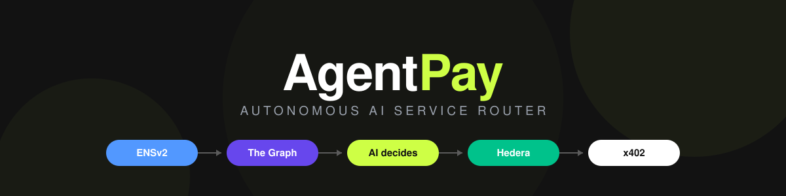
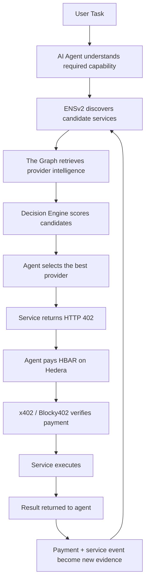
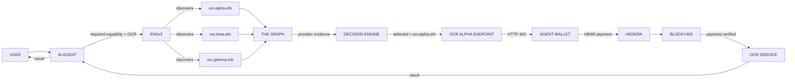
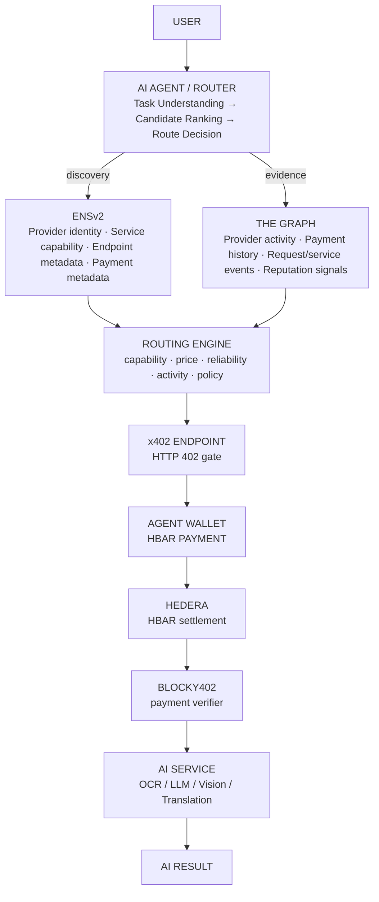
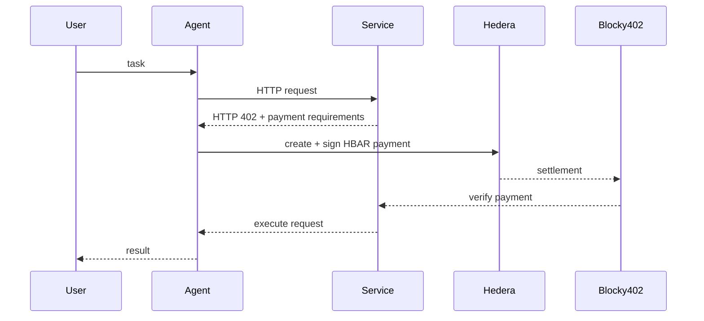

<p align="center">
  
</p>

<p align="center">
  <b>Autonomous AI service router — discover the best service, prove why it was chosen, and pay for it autonomously.</b>
</p>

<p align="center">
  <a href="https://ens.domains/"></a>
  <a href="https://thegraph.com/"></a>
  <a href="https://hedera.com/"></a>
  <a href="https://x402.org/"></a>
  <a href="https://github.com/blocky402/x402"></a>
  <br/>
  
  
  
  
</p>

> **ENS discovers → The Graph evaluates → AI decides → Hedera pays → x402 verifies → Service executes**

AgentPay is an agent-native routing layer for paid AI services.

Instead of giving an AI agent a fixed API key and telling it which provider to use, AgentPay lets the agent **discover available services, evaluate them using on-chain evidence, choose the best provider for the current task, and pay for the selected service automatically**.

The result is not just an AI marketplace. It is an **autonomous economic decision loop** where the AI agent is the actor that selects and pays for external capabilities.

---

## 📚 Table of Contents

1. [The Problem](#1-the-problem)
2. [The Core Idea](#2-the-core-idea)
3. [Why This Is Different](#3-why-this-is-different)
4. [How It Works](#4-how-it-works)
5. [The Autonomous Routing Decision](#5-the-autonomous-routing-decision)
6. [Sponsor Technologies as Core Infrastructure](#6-sponsor-technologies-as-core-infrastructure)
7. [End-to-End Example](#7-end-to-end-example)
8. [Architecture](#8-architecture)
9. [Provider Registration](#9-provider-registration)
10. [Provider Intelligence with The Graph](#10-provider-intelligence-with-the-graph)
11. [ENSv2 Discovery and Identity](#11-ensv2-discovery-and-identity)
12. [x402 + Hedera Payment Flow](#12-x402--hedera-payment-flow)
13. [Decision Engine](#13-decision-engine)
14. [Data Model](#14-data-model)
15. [Smart Contracts](#15-smart-contracts)
16. [Backend APIs](#16-backend-apis)
17. [Frontend](#17-frontend)
18. [Tech Stack](#18-tech-stack)
19. [Demo](#19-demo)
20. [Why It Matters](#20-why-it-matters)
21. [Honest Limitations](#21-honest-limitations)
22. [Project Structure](#22-project-structure)
23. [Getting Started](#23-getting-started)
24. [References](#24-references)

---

## 🧩 1. The Problem

AI agents are becoming capable of performing multi-step tasks, but they are still tightly coupled to the services developers manually configure for them.

A typical agent workflow looks like this:

1. A developer chooses an AI provider.
2. A human creates an account.
3. A human adds payment information.
4. A human creates an API key.
5. The key is placed inside the agent's environment.
6. The agent repeatedly uses the same provider until the key, quota, price, or availability becomes a problem.

This creates three major limitations.

### 1.1 Agents cannot truly discover capabilities

The agent usually knows the provider before the task begins. It is not making a runtime decision between competing services.

### 1.2 Agents cannot economically choose the best provider

Even when multiple providers exist, the agent often has no machine-readable evidence about price, activity, usage, or historical behavior.

### 1.3 Agents cannot independently pay for the capability they need

A human usually remains responsible for provisioning the account, managing the API key, funding the service, or approving a new provider.

The missing primitive is therefore not another marketplace.

> **It is a decision-and-payment layer for autonomous software.**

---

## 💡 2. The Core Idea

AgentPay gives an AI agent a runtime ability that most agents do not have today:

> **Find a capability → compare providers → select one based on evidence → pay → consume the capability.**

The agent does not simply ask, *"Which OCR API did the developer configure?"*

It asks:

> **"I need OCR. Which available provider is the best option for this request, and can I pay for it myself?"**

AgentPay answers that question using three protocol layers:

| Layer | Responsibility |
|---|---|
| **ENSv2** | Identity, naming, capability discovery, and provider metadata |
| **The Graph** | Live on-chain provider intelligence and historical evidence |
| **Hedera + x402** | Autonomous HBAR settlement for the selected service |

An AI decision engine sits above these layers and turns their data into an actual runtime decision.

### Core Loop



The final step is important: every completed interaction can contribute new observable history for future routing decisions.

---

## 🆚 3. Why This Is Different

AgentPay should **not** be presented as simply:

> *"An AI marketplace using Hedera, The Graph, and ENS."*

That framing makes the technologies look bolted on.

The stronger framing is:

> **AgentPay is an autonomous AI service router that uses identity, blockchain intelligence, and machine-native payments to make runtime provider decisions.**

Each sponsor technology has a distinct job:

| Sponsor | Question it answers | Role |
|---|---|---|
| **ENS** | *"Who can do this?"* | Providers expose machine-readable identities and capabilities through ENSv2 names and records |
| **The Graph** | *"Who should I trust or prefer?"* | The router uses live indexed blockchain data to evaluate candidates using measurable signals instead of blindly selecting the first matching service |
| **AI** | *"Which one should I choose for this task?"* | The decision engine combines capability, price, and provider evidence to make a runtime choice |
| **Hedera** | *"How does the agent pay?"* | The agent settles the selected service directly with HBAR |
| **x402** | *"How does the service request payment?"* | The HTTP endpoint becomes machine-payable through `402 Payment Required` |

This makes every integration **load-bearing** rather than decorative.

---

## 🔄 4. How It Works

### Step 1 — The user gives the agent a task

Example:

> *"Extract the text and totals from this invoice."*

The agent determines that it needs an **OCR / document extraction capability**.

### Step 2 — Agent discovers providers through ENSv2

The router resolves registered service identities and retrieves metadata such as:

- service name
- capability
- endpoint
- supported input/output formats
- payment information
- provider identity
- optional service policies

Example candidate set:

```text
ocr.alpha.eth
ocr.beta.eth
ocr.gamma.eth
```

### Step 3 — The Graph retrieves provider intelligence

The router queries indexed blockchain activity associated with the providers.

Example signals:

```text
Provider A
- price: 0.01 HBAR
- completed requests: 2,431
- successful requests: 2,401
- recent activity: high
- transaction history: active

Provider B
- price: 0.007 HBAR
- completed requests: 48
- recent activity: low

Provider C
- price: 0.012 HBAR
- completed requests: 8,921
- recent activity: very high
```

The exact reputation metrics can evolve as the implementation matures; the important principle is that **routing decisions use live indexed evidence rather than static UI ratings**.

### Step 4 — The AI scores the candidates

The decision engine considers the task requirements together with provider data.

For example:

```text
score(provider) =
    capability_match
  + reliability_signal
  + recent_activity
  - normalized_price
```

The weights can be configured per task.

- A **latency-sensitive** task can prioritize recent activity and reliability.
- A **cost-sensitive** task can prioritize price.
- A **quality-sensitive** task can prioritize historical success signals or a verified quality metric.

### Step 5 — The agent chooses a provider

The agent records a machine-readable routing decision:

```text
Task: invoice OCR
Selected: ocr.alpha.eth
Reason:
- capability matched
- strong recent activity
- lower expected cost than premium provider
- sufficient historical usage evidence
```

This creates an auditable explanation for the route rather than a black-box provider selection.

### Step 6 — The agent calls the x402 endpoint

The selected provider is protected by an x402 payment gate.

The initial HTTP request receives:

```http
HTTP/1.1 402 Payment Required
```

with payment requirements describing the amount, recipient, and request context.

### Step 7 — The agent pays on Hedera

The agent wallet signs the required HBAR transfer and submits it to Hedera.

There is no separate human approval for the individual inference call.

### Step 8 — Blocky402 verifies the payment

The facilitator verifies that the payment satisfies the service's requirements.

Once the payment is accepted, the service is unlocked.

### Step 9 — The service executes

The OCR provider processes the invoice and returns the result to the agent.

### Step 10 — The interaction becomes new evidence

The payment and service execution can be indexed for future provider analysis.

The router therefore becomes progressively more useful as provider activity accumulates.

---

## 🧭 5. The Autonomous Routing Decision

This is the heart of AgentPay.

The router is not merely forwarding an HTTP request. It is making an **economic choice**.

### Candidate Evaluation

For every discovered service, AgentPay builds a candidate object similar to:

```json
{
  "name": "ocr.alpha.eth",
  "capability": "ocr",
  "price": "0.01 HBAR",
  "recentRequests": 421,
  "completedRequests": 2431,
  "successRate": 0.987,
  "endpoint": "https://example.com/ocr",
  "paymentMethod": "x402-hedera"
}
```

### Decision Output

The agent produces a structured route decision:

```json
{
  "task": "invoice_ocr",
  "selectedProvider": "ocr.alpha.eth",
  "alternativesConsidered": [
    "ocr.beta.eth",
    "ocr.gamma.eth"
  ],
  "decisionFactors": {
    "capability": 0.30,
    "reliability": 0.35,
    "activity": 0.20,
    "price": 0.15
  },
  "reason": "Best reliability/cost tradeoff for this task"
}
```

The exact scoring implementation can be deterministic, model-assisted, or hybrid. The important property is that **the provider is selected at runtime from discovered evidence**.

---

## 🏗️ 6. Sponsor Technologies as Core Infrastructure

AgentPay is intentionally designed so the three target ecosystems form one dependency chain.

### ENSv2 — Identity + Discovery

ENS provides the naming and discovery layer for AI services.

Example hierarchy:

```text
agentpay.eth
├── ocr
│   ├── alpha
│   ├── beta
│   └── gamma
├── translation
│   ├── alpha
│   └── beta
└── image-analysis
    ├── alpha
    └── gamma
```

A service identity can expose or point to records describing its capability and endpoint.

The agent does not need a hardcoded provider list.

### The Graph — Provider Intelligence

The Graph is the evidence layer.

AgentPay indexes service and payment activity so the router can query live data such as:

- provider activity
- completed requests
- payment history
- recent service usage
- historical success signals
- other indexed metrics relevant to provider selection

The Graph is therefore not used only to display analytics. **Its data changes which provider the agent chooses.**

### Hedera — Economic Settlement

Hedera is the payment network on which the agent settles the selected service with HBAR.

The payment is part of the task execution itself.

### x402 — Machine-Native Payment Gate

x402 turns the service endpoint into a payment-aware HTTP interface:

```text
Request
  ↓
402 Payment Required
  ↓
Agent signs payment
  ↓
Hedera settlement
  ↓
Payment verification
  ↓
Service response
```

### Blocky402 — Payment Verification

Blocky402 provides the facilitator/verification component between the payment and the gated service.

AgentPay focuses on the orchestration layer rather than reimplementing the payment protocol from scratch.

---

## 🎬 7. End-to-End Example

### User Task

> **"Extract the text and invoice total from this image."**

### Runtime



### What the agent actually did

The important event is not the OCR inference itself.

The important event is that the agent independently:

1. identified the capability it needed,
2. discovered multiple providers,
3. evaluated their on-chain evidence,
4. selected one,
5. paid for the call,
6. received the service,
7. produced a verifiable payment trail.

That is the autonomous service-routing primitive AgentPay is designed to demonstrate.

---

## 🏛️ 8. Architecture



---

## 📝 9. Provider Registration

A provider joins AgentPay by publishing enough information for an autonomous agent to discover and evaluate its service.

### Provider Metadata

Conceptually:

```text
ENS name
Capability
Endpoint
Description
Input format
Output format
Pricing
Payment network
Payment method
Provider address
Status
```

### Example

```text
ocr.alpha.eth

Capability: document-ocr
Endpoint: https://alpha.example/ocr
Price: 0.01 HBAR / request
Payment: x402 on Hedera
Provider: 0.0.xxxxx
Status: active
```

The provider does not need to be selected manually by the user.

It becomes one candidate in the agent's service discovery space.

---

## 📊 10. Provider Intelligence with The Graph

A major design goal is to make The Graph **decision-critical**.

The router should not query The Graph merely to show a dashboard chart. The answer from The Graph must be able to **change the selected provider**.

### Example indexed entities

```text
Provider
- id
- ENS name
- capability
- active

Service
- id
- provider
- endpoint
- price
- capability

Request
- id
- provider
- payer
- timestamp
- status

Payment
- id
- request
- amount
- token/currency
- timestamp
- payer
- recipient

Inference
- id
- request
- success
- completedAt
```

### Example queries used by the router

```text
Which OCR providers are active?

Which providers have recent activity?

How many paid requests has each provider completed?

What has the provider charged historically?

Which provider has stronger recent usage evidence?
```

These queries feed the routing decision.

### Why indexed data matters

Without The Graph, the system can **discover** a provider.

With The Graph, the system can **evaluate** the provider using observable history.

> That distinction is central to AgentPay.

---

## 🌐 11. ENSv2 Discovery and Identity

ENS is the discovery and identity surface for service providers.

### Example naming model

```text
agentpay.eth

services.agentpay.eth
services.agentpay.eth/ocr
services.agentpay.eth/ocr/alpha
services.agentpay.eth/ocr/beta
services.agentpay.eth/vision/alpha
```

The exact naming hierarchy can be adjusted during implementation, but the principle remains the same: **service identity should be resolvable and machine-readable**.

### Why ENS matters

A raw endpoint such as:

```text
https://provider.example/api/ocr
```

is not a useful autonomous identity.

A name such as:

```text
ocr.alpha.eth
```

can become the stable identity by which the agent discovers and refers to the service.

ENS therefore becomes part of the agent's service directory rather than a cosmetic profile field.

---

## 💸 12. x402 + Hedera Payment Flow

AgentPay uses x402 as the payment handshake between an agent and a paid service.

### Payment lifecycle



### What makes this autonomous?

The router does not ask a human to:

- open a provider account,
- add a credit card,
- copy an API key,
- manually approve every inference,
- reconcile a private billing dashboard.

The agent already has an economic identity and can use it to acquire the capability it needs.

---

## ⚖️ 13. Decision Engine

The routing engine transforms discovery data into a service choice.

### Inputs

```text
Task requirements
↓
Required capability
↓
ENS-discovered providers
↓
The Graph provider evidence
↓
Current prices
↓
Provider state / availability
↓
Agent budget / policy
```

### Candidate score

A simple initial implementation can use a weighted score:

```text
providerScore =
    capabilityMatch × W1
  + reliabilitySignal × W2
  + activitySignal × W3
  + policyFit × W4
  - priceScore × W5
```

More advanced routing can later incorporate:

- latency
- task-specific quality
- historical success rate
- agent budget
- provider preference policies
- risk thresholds
- multi-step task requirements

### Safety / budget policy

The agent should not spend indefinitely.

Example policy:

```json
{
  "maxSpendPerRequest": "0.05 HBAR",
  "maxSpendPerTask": "0.20 HBAR",
  "allowedCapabilities": ["ocr", "vision", "translation"]
}
```

The routing engine must respect these constraints before paying.

---

## 🗄️ 14. Data Model

### Provider

```text
providerId
ensName
capability
endpoint
paymentAddress
pricePerRequest
active
registeredAt
```

### Request

```text
requestId
taskId
providerId
agentId
capability
createdAt
status
```

### Payment

```text
paymentId
requestId
agentId
providerId
amount
network
transactionHash
timestamp
status
```

### Provider intelligence

```text
providerId
recentRequests
completedRequests
successfulRequests
recentPayments
activityScore
reliabilityScore
```

The exact fields can change according to the deployed contracts/subgraph schema.

---

## 📜 15. Smart Contracts

Smart contracts should remain intentionally small. Their job is to establish verifiable state and events, not to reproduce application logic unnecessarily.

### `ServiceRegistry.sol`

Conceptually stores:

```text
serviceId
provider
ENS name / identifier
capability
endpoint or endpoint reference
price
active
registeredAt
```

Events:

```text
ServiceRegistered(...)
ServiceUpdated(...)
ServiceDeactivated(...)
```

### `InferenceRegistry.sol` or equivalent event layer

Where appropriate, emit service execution/payment-related events that The Graph can index.

Example:

```text
InferenceRequested(...)
InferencePaid(...)
InferenceCompleted(...)
```

### Design principle

The contracts provide the authoritative event stream.

The Graph turns that event stream into queryable intelligence.

The router turns that intelligence into decisions.

---

## 🔌 16. Backend APIs

The backend exposes the orchestration layer between the agent, discovery systems, payment rails, and services.

| Method | Endpoint | Purpose |
|---|---|---|
| `GET` | `/api/services` | Returns discoverable candidate services |
| `POST` | `/api/services` | Registers or updates a service reference |
| `POST` | `/api/route` | Routes a task to the best provider |
| `POST` | `/api/inference` | Starts the selected service request and payment flow |
| `POST` | `/api/verify-payment` | Returns payment verification status and associated request information |
| `GET` | `/api/providers/:id/intelligence` | Returns the indexed signals used by the routing engine |
| `GET` | `/api/agents/:id/history` | Returns the agent's previous service selections and payments |

<details>
<summary><b>Request / response examples</b></summary>

**Route a task**

```http
POST /api/route
```

Input:

```json
{
  "task": "extract invoice text",
  "capability": "ocr",
  "budget": "0.05 HBAR"
}
```

Output:

```json
{
  "selectedProvider": "ocr.alpha.eth",
  "reason": "Best reliability/cost tradeoff",
  "candidatesConsidered": 3
}
```

</details>

---

## 🖥️ 17. Frontend

The UI is designed around **showing autonomous decisions**, not looking like a generic marketplace.

### Page 1 — Agent Console

Primary screen.

Displays:

- current task
- required capability
- candidates discovered
- provider scores
- selected provider
- selection reason
- payment status
- final result

The goal is to let a judge see the agent thinking in terms of services, evidence, and payment.

### Page 2 — Provider Discovery

Shows ENS identities and their capabilities.

Example:

```text
OCR

ocr.alpha.eth      0.010 HBAR
ocr.beta.eth       0.007 HBAR
ocr.gamma.eth      0.012 HBAR
```

### Page 3 — Provider Intelligence

Shows the data that influenced the route:

```text
Provider: ocr.alpha.eth

Recent activity     █████████░
Historical usage    ████████░░
Reliability         ██████████
Price               0.010 HBAR
```

The important interaction is:

> **"This provider was selected because these signals were better."**

### Page 4 — Payment Trace

Shows:

- HTTP 402 received
- payment request
- agent signature
- Hedera transaction
- verification status
- service unlock

### Page 5 — Execution Result

Displays the returned inference result and a compact proof trail linking it back to the provider, payment, and request.

---

## 🛠️ 18. Tech Stack

| Layer | Technology | Purpose |
|---|---|---|
| Agent UI | React / Next.js | Agent console and demo interface |
| Backend | TypeScript / Node.js | Routing and orchestration |
| Agent logic | LLM + deterministic policy layer | Task understanding and provider selection |
| Identity | ENSv2 | Provider identity and discovery |
| Blockchain data | The Graph | Indexed provider/payment intelligence |
| Payments | x402 | HTTP-native payment handshake |
| Settlement | Hedera | HBAR payments and public transaction record |
| Facilitator | Blocky402 | x402 payment verification / facilitation |
| Contracts | Solidity / Hedera EVM-compatible environment | Registry and event emission |
| Storage | App database / indexed data | Non-authoritative UI/application state |

The authoritative boundaries should remain clear:

```text
ENS      = identity / discovery
Graph    = indexed evidence
Hedera   = settlement / on-chain events
x402     = payment protocol
Agent    = decision maker
Backend  = orchestration
```

---

## 🎥 19. Demo

The demo should tell one continuous story rather than showing disconnected sponsor integrations.

| Time | Beat | What the judge sees |
|---|---|---|
| **0:00–0:20** | Give the agent a task | *"Extract the text and total from this invoice."* — the agent identifies the `ocr` capability |
| **0:20–0:45** | Discover providers through ENS | Three OCR providers with ENS identities: `ocr.alpha.eth`, `ocr.beta.eth`, `ocr.gamma.eth` |
| **0:45–1:15** | Evaluate providers with The Graph | Indexed evidence side by side. The agent explains: *"Alpha costs slightly more than Beta, but its recent activity and historical execution signals make it the better choice under my current policy."* |
| **1:15–1:35** | Make the routing decision | The exact provider selected and the reason. The moment judges understand that **The Graph changed the behavior of the agent** |
| **1:35–2:00** | Trigger x402 | The agent requests the endpoint. Show `HTTP 402 Payment Required` |
| **2:00–2:20** | Pay on Hedera | The agent wallet signing and the Hedera transaction being submitted |
| **2:20–2:40** | Verify and execute | Blocky402 verifies the payment. The service unlocks and returns the OCR result |
| **2:40–3:00** | Show the proof | ENS identity → provider evidence from The Graph → routing decision → Hedera payment → x402 verification → inference result |

### Closing line

> **"AgentPay doesn't tell an AI agent which service to use. It lets the agent discover the market, evaluate the evidence, choose the service, and pay for it itself."**

---

## 🌍 20. Why It Matters

The long-term vision is a web of **machine-consumable services** where agents are not hardcoded to one provider.

A future agent could need:

```text
OCR
Translation
Speech-to-text
Web search
Image generation
Fraud detection
Financial data
Knowledge retrieval
Code execution
Specialized reasoning
```

Instead of embedding a provider for every capability, the agent can discover a service at runtime.

That changes the architecture from:

```text
Agent → Fixed API → Provider
```

to:

```text
Agent
  ↓
Discover
  ↓
Evaluate
  ↓
Choose
  ↓
Pay
  ↓
Execute
```

AgentPay is a prototype for this service economy.

---

## ⚠️ 21. Honest Limitations

AgentPay is a hackathon proof-of-concept, not a production autonomous economy.

### Provider reputation is still an evolving problem

On-chain activity is evidence, but activity alone does not prove model quality. A heavily used service can still produce poor outputs.

### The router's quality depends on its signals

Bad or sparse indexed data can lead to bad routing decisions. More sophisticated reputation and validation mechanisms are future work.

### The agent needs bounded authority

Autonomous payment requires explicit budget and policy limits. The system should never assume unlimited spending authority.

### Testnet constraints

The prototype may use testnet wallets, faucet-funded HBAR, and demo service providers. Production deployment would require stronger key management, monitoring, rate limits, and operational safeguards.

### x402 / facilitator dependency

The payment flow depends on the selected x402 implementation and facilitator infrastructure remaining available and compatible with the deployed service.

---

## 📁 22. Project Structure

<details>
<summary><b>Reference repository layout</b></summary>

```text
agentpay/
│
├── apps/
│   ├── web/                 # React / Next.js frontend
│   └── agent/               # Agent runtime / routing engine
│
├── services/
│   ├── api/                 # Backend orchestration API
│   ├── router/              # Provider scoring and route decisions
│   └── providers/           # Demo AI services
│
├── contracts/
│   ├── ServiceRegistry.sol
│   └── InferenceRegistry.sol
│
├── subgraph/
│   ├── schema.graphql
│   ├── mappings/
│   └── subgraph.yaml
│
├── ens/
│   └── provider-records/    # ENSv2 registration/configuration
│
├── x402/
│   └── middleware/          # Payment-gated service integration
│
├── docs/
│   └── architecture.md
│
└── README.md
```

The final structure can differ from this reference layout.

</details>

---

## 🚀 23. Getting Started

> The exact commands below should be updated to match the final implementation before submission.

### 1. Clone

```bash
git clone <repository-url>
cd agentpay
```

### 2. Install

```bash
npm install
```

### 3. Configure environment variables

Example:

```env
# Hedera
HEDERA_NETWORK=testnet
HEDERA_ACCOUNT_ID=0.0.xxxxx
HEDERA_PRIVATE_KEY=...

# ENS
ENS_RPC_URL=...
ENS_REGISTRY=...

# The Graph
THE_GRAPH_ENDPOINT=...

# x402 / Blocky402
BLOCKY402_FACILITATOR_URL=...

# Agent
AGENT_MAX_SPEND_PER_REQUEST=0.05
AGENT_MAX_SPEND_PER_TASK=0.20

# Application
PORT=3000
```

Never commit private keys or secrets.

### 4. Start the application

```bash
npm run dev
```

### 5. Register demo providers

Register multiple services with intentionally different prices and activity histories so the routing decision is visible during the demo.

### 6. Run the autonomous flow

Submit a task from the Agent Console and observe:

```text
Task
→ ENS discovery
→ Graph evaluation
→ route decision
→ x402 402
→ Hedera payment
→ Blocky402 verification
→ inference
→ result
```

---

## 🔗 24. References

| Topic | Reference |
|---|---|
| ENS | https://ens.domains/ |
| ENS Developer Documentation | https://docs.ens.domains/ |
| The Graph | https://thegraph.com/ |
| The Graph Documentation | https://thegraph.com/docs/ |
| Hedera | https://hedera.com/ |
| Hedera Developer Documentation | https://docs.hedera.com/ |
| x402 | https://x402.org/ |
| Blocky402 | https://github.com/blocky402/x402 |
| HashScan | https://hashscan.io/testnet |
| ETHGlobal | https://ethglobal.com/ |

---

<p align="center">
  <b>Built for ETHOnline 2026</b><br/>
  <i>ENS discovers. The Graph provides evidence. AI decides. Hedera settles. x402 unlocks.</i>
</p>